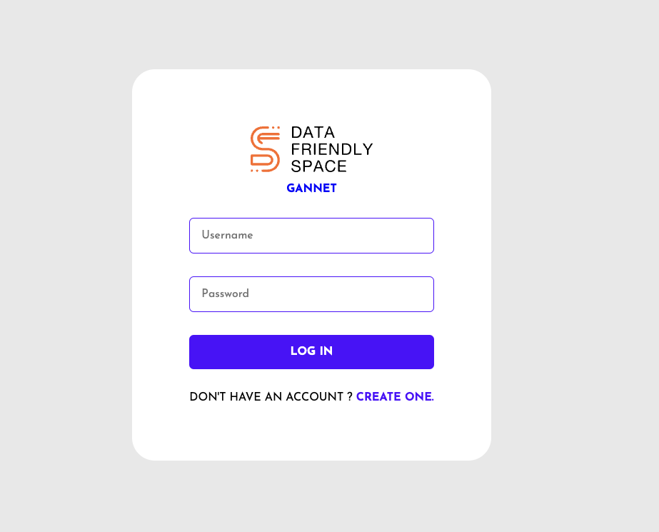

# Morus-bassanus

This repository is for deploying the light version of **Morus-bassanus**, a platform designed to provide instant support and facilitate informed decision-making for humanitarians. The system integrates with various humanitarian sources and leverages advanced AI to enhance crisis response and resource management.

## Table of Contents

- [Key Features](#key-features)
  - [Crisis Information and Updates](#crisis-information-and-updates)
  - [Multi-Source Integration](#multi-source-integration)
  - [Decision Support Tools](#decision-support-tools)
  - [Communication and Collaboration](#communication-and-collaboration)
  - [User Management and Personalization](#user-management-and-personalization)
  - [Reporting and Documentation](#reporting-and-documentation)
  - [Security and Privacy](#security-and-privacy)
  - [Offline Access](#offline-access)
  - [User Feedback and Improvement](#user-feedback-and-improvement)
- [Installation](#installation)
- [Usage](#usage)
- [Contributing](#contributing)
- [License](#license)

## Key Features

### Crisis Information and Updates
- **Real-Time Crisis Updates:** Integrated with sources like ReliefWeb to provide real-time updates on ongoing crises, including new developments and key statistics.
- **Historical Data:** Access to historical data on past crises to provide context and aid in trend analysis.

### Multi-Source Integration
- **API Integrations:** Connects with multiple humanitarian data sources, including ReliefWeb, UN OCHA, and local NGOs, to aggregate and provide a comprehensive view.
- **Data Aggregation:** Aggregates data from different sources for a unified user interface.

### Decision Support Tools
- **Data Visualization:** Interactive maps, charts, and dashboards to visualize crisis data and trends.
- **Predictive Analytics:** Uses AI and machine learning to predict future trends and needs based on historical data.

### Communication and Collaboration
- **Chat Interface:** Enhanced ChatGPT integration with context-aware assistance, multilingual support, and interactive Q&A.
- **Collaboration Tools:** Includes shared notes, task management, and real-time updates for team collaboration.

### User Management and Personalization
- **User Profiles:** Allows users to create and manage profiles with preferences and previous interactions.
- **Custom Alerts:** Enables users to set up custom alerts and notifications for specific crises or updates.

### Reporting and Documentation
- **Automated Reporting:** Generates reports on crisis situations, resource usage, and response effectiveness.
- **Documentation Management:** Tools for documenting actions, decisions, and lessons learned.

### Security and Privacy
- **Data Protection:** Ensures secure storage and transmission of data, adhering to relevant privacy regulations.
- **Access Controls:** Implements role-based access controls to restrict sensitive information to authorized users.

### Offline Access
- **Offline Capabilities:** Provides offline access to critical information in areas with limited connectivity.

### User Feedback and Improvement
- **Feedback Mechanisms:** Features for users to provide feedback on the system and its features.
- **Continuous Improvement:** Regular updates based on user feedback and evolving needs.

## Installation

1. **Clone the Repository**
   ```bash
   git clone git clone https://github.com/parsimeikoikai/Morus-bassanus.git

## Development Setup
- In this project we are using python3.11 and poetry as our env manager.
- First, install poetry from this installation [guide](https://python-poetry.org/docs/#installation).
- To add any package run `poetry add package`.

## Deployment with Docker
1- Prepare .env file with same info as [.env.sample](.env.sample) file

2- Use the docker compose file to build and run the services.

`docker compose up --build`

3- Visit http://0.0.0.0:9000/docs to see the Swager UI of the appliation.

### Endpoints
- `/`
  - Display an introductory message
  
- `/ask` 
  - Takes a query and returns an answer and the sources used to answer the query.
  - Input:

    ```json
    {"query": "the user query"}
    ```
  - Output:
    ```json
    {"answer": "The LLM answer",
    "sources": "The sources used to answer (article titles)"}
    ```
- `/retrieve`
  - Takes a query and returns the sources similar to thihs query.
  - Input:

    ```json
    {"query": "the user query"}
    ```
  - Output:
    ```json
    {["page_content": "Text content",
    "meta": "Document meta such as source"]}
    ```
### Services
- `backend`:
  - The server service backed by FastAPI.

- `scripts`:
  - Scripts used to download the data from S3 and vectorize it and embed it to the DB.

- `weaviate`:
  - The vectorized DB service, backed by Weaviate client and OpenAI embedding service.

## Code Structure
- dockers:
  - Contains the docker files for used services.
- scripts:
  - Contains the initial scripts that used before running the service.
- src:
  - Contains the code for the backend API and the DB modules, and LLM logic.


## Frontend 



## Installation Guide

### Requirements
- [Nodejs](https://nodejs.org/en/download)
- [Mongodb](https://www.mongodb.com/docs/manual/administration/install-community/)

Both should be installed and make sure mongodb is running.

```shell
git clone https://github.com/parsimeikoikai/Morus-bassanus.git
cd Morus-bassanus
```
Now rename env files from .env.example to .env
```shell

cd public
mv .env.example .env
cd ..
cd server
mv .env.example .env
cd ..
```

Now install the dependencies
```shell
cd server
yarn
cd ..
cd public
yarn
```
We are almost done, Now just start the development server.

For Frontend.
```shell
cd client
yarn start
```
For Backend.

Open another terminal in folder, Also make sure mongodb is running in background.
```shell
cd server
yarn start
```

Done! Now open localhost:3000 in your browser.
