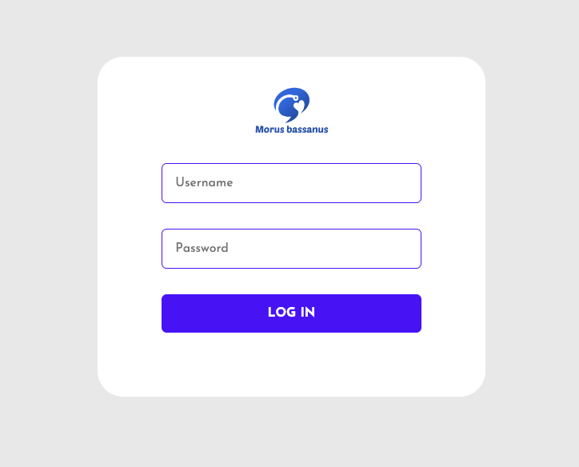

# Morus-bassanus
This repo is for deploying the light version of Morus-bassanus application

## Development Setup
- In this project we are using python3.11 and poetry as our env manager.
- First, install poetry from this installation [guide](https://python-poetry.org/docs/#installation).
- To add any package run `poetry add package`.

## Deployment with Docker
1- Prepare .env file with same info as [.env.sample](.env.sample) file

2- Use the docker compose file to build and run the services.

`docker compose up --build`

3- Visit http://0.0.0.0:9000/docs to see the Swager UI of the appliation.

### Endpoints
- `/`
  - Display an introductory message
  
- `/ask` 
  - Takes a query and returns an answer and the sources used to answer the query.
  - Input:

    ```json
    {"query": "the user query"}
    ```
  - Output:
    ```json
    {"answer": "The LLM answer",
    "sources": "The sources used to answer (article titles)"}
    ```
- `/retrieve`
  - Takes a query and returns the sources similar to thihs query.
  - Input:

    ```json
    {"query": "the user query"}
    ```
  - Output:
    ```json
    {["page_content": "Text content",
    "meta": "Document meta such as source"]}
    ```
### Services
- `backend`:
  - The server service backed by FastAPI.

- `scripts`:
  - Scripts used to download the data from S3 and vectorize it and embed it to the DB.

- `weaviate`:
  - The vectorized DB service, backed by Weaviate client and OpenAI embedding service.

## Code Structure
- dockers:
  - Contains the docker files for used services.
- scripts:
  - Contains the initial scripts that used before running the service.
- src:
  - Contains the code for the backend API and the DB modules, and LLM logic.


## Frontend 




## Installation Guide

### Requirements
- [Nodejs](https://nodejs.org/en/download)
- [Mongodb](https://www.mongodb.com/docs/manual/administration/install-community/)

Both should be installed and make sure mongodb is running.

```shell
git clone https://github.com/parsimeikoikai/Morus-bassanus.git
cd Morus-bassanus
```
Now rename env files from .env.example to .env
```shell

cd public
mv .env.example .env
cd ..
cd server
mv .env.example .env
cd ..
```

Now install the dependencies
```shell
cd server
yarn
cd ..
cd public
yarn
```
We are almost done, Now just start the development server.

For Frontend.
```shell
cd client
yarn start
```
For Backend.

Open another terminal in folder, Also make sure mongodb is running in background.
```shell
cd server
yarn start
```

Done! Now open localhost:3000 in your browser.
